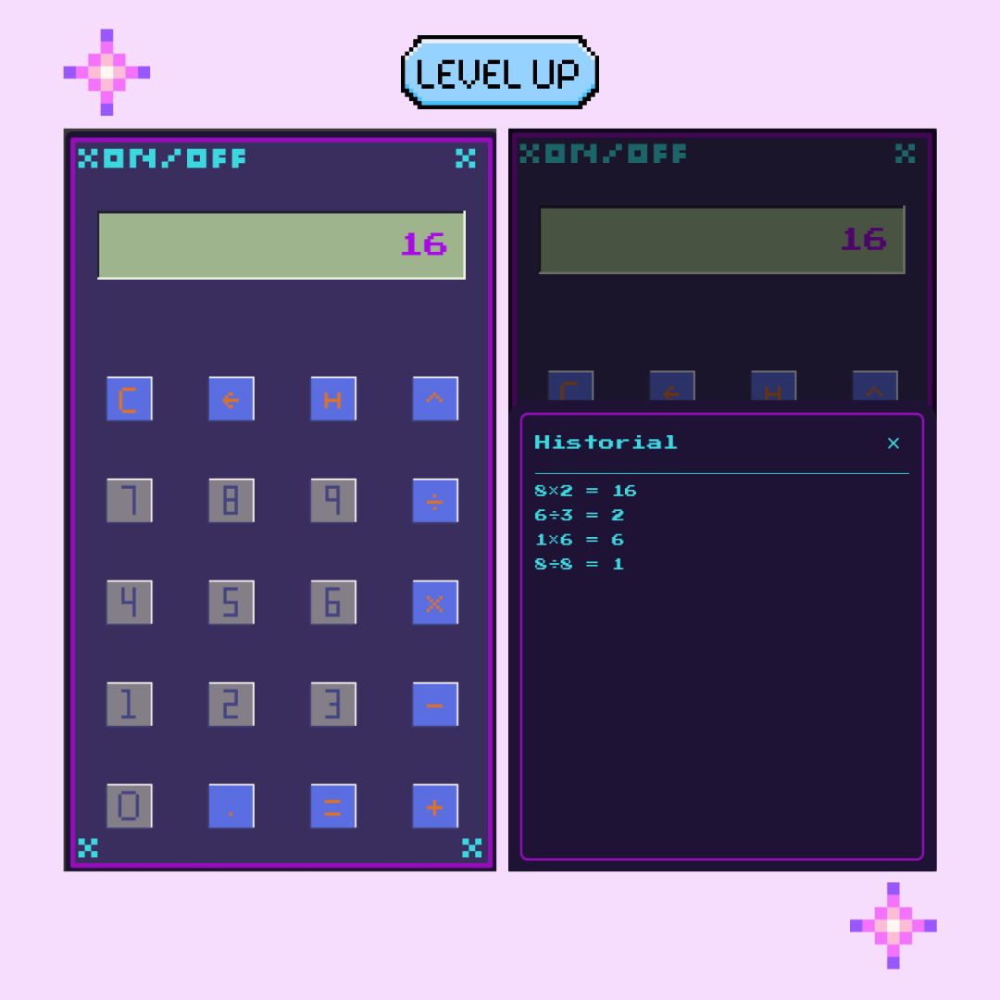

# 📱 Calculadora con historial de 30 operaciones realizadas con estilo Retro Pixelart – Flutter

🎓 Proyecto académico

Este proyecto fue desarrollado como parte del caso de estudio integrador en la actividad
Lenguajes de Programación para Aplicaciones Móviles, correspondiente al plan de estudios
de la carrera de Desarrollo de Software y Aplicativos Móviles,
impartida por el Tecnológico Politécnico Internacional.

###

Una calculadora móvil desarrollada con Flutter, diseñada con estética pixelart e interfaz personalizada.  
Este proyecto se realiza con fines educativos para el proyecto de caso integrador de la asignatura Lenguajes de Programación para Aplicaciones Móviles, y se diseña con un estilo retro y lógica matemática.



---

## 🧩 Descripción general

La aplicación simula una calculadora tradicional con una interfaz totalmente personalizada y desarrollada desde cero.  
Cada elemento visual fue diseñado en **Aseprite** en estilo pixelart, y la lógica de cálculos fue implementada utilizando la librería `math_expressions` en Dart.

---

## ✨ Funcionalidades principales

- Interfaz completamente personalizada con botones pixelart
- Tipografía retro (`PressStart2P`) para todo el texto visible
- Cálculos reales con operaciones básicas y potencias (`+`, `-`, `×`, `÷`, `^`)
- Botones con animación de presionado (`pressedImage`)
- Historial de operaciones (últimas 30)
- Modal flotante estilizado para ver historial
- Código modular, organizado y mantenible

---

## 🛠️ Tecnologías utilizadas

| Herramienta         | Descripción                                                   |
|----------------------|---------------------------------------------------------------|
| **Flutter**          | Framework para desarrollo de aplicaciones móviles multiplataforma |
| **Dart**             | Lenguaje de programación utilizado en Flutter                  |
| **Aseprite**         | Software de diseño pixelart utilizado para crear los assets   |
| **math_expressions** | Librería para evaluar expresiones matemáticas sin `eval()`    |
| **Google Fonts**     | Tipografía `PressStart2P` para el estilo retro del proyecto    |

---

## ⚙️ Instrucciones de instalación

Requisitos: [Flutter SDK](https://flutter.dev/docs/get-started/install)

```bash
git clone https://github.com/ElisPetroVertel17/calculadora_retro.git
cd calculadora_retro
flutter pub get
flutter run

📍 Tecnológico Politécnico Internacional
🗓️ Mayo de 2025

